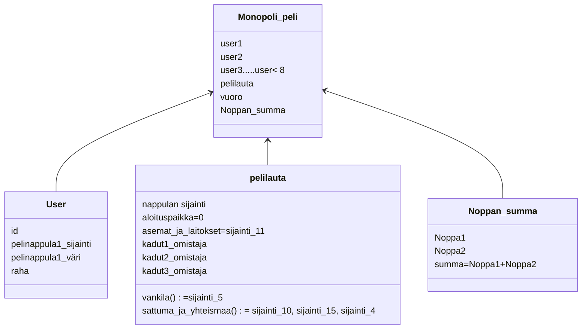

```mermaid
 classDiagram
      Monopoli_peli <-- User
      Monopoli_peli <-- pelilauta
      Monopoli_peli  <-- Noppan_summa
      class Monopoli_peli{
          user1
          user2
          user3.....user< 8
          pelilauta
          vuoro
          Noppan_summa
      }
      class User{
          id
          pelinappula1_sijainti
          pelinappula1_väri
	  raha
      }
      class pelilauta{
          nappulan sijainti
          aloituspaikka=0
          vankila()=sijainti_5
          sattuma_ja_yhteismaa()= sijainti_10, sijainti_15, sijainti_4
          asemat_ja_laitokset=sijainti_11
          kadut1_omistaja
          kadut2_omistaja
          kadut3_omistaja
          
     }
      class Noppan_summa{
          Noppa1
          Noppa2
          summa=Noppa1+Noppa2       
      }

```
