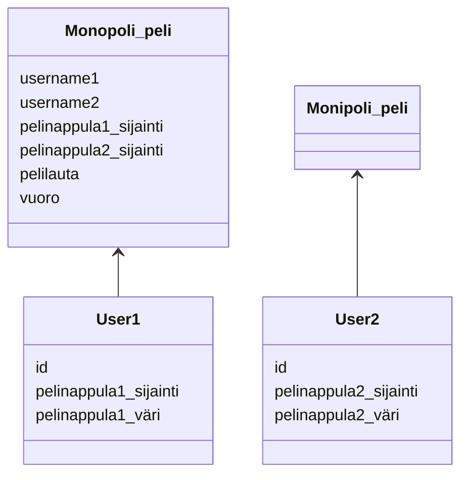

```mermaid
 classDiagram
      Monopoli_peli <-- User1
      Monipoli_peli <-- User2
      class Monopoli_peli{
          username1
          username2
          pelinappula1_sijainti
          pelinappula2_sijainti
          pelilauta
          vuoro
      }
      class User1{
          id
          pelinappula1_sijainti
          pelinappula1_väri
	  
      }
      class User2{
          id
          pelinappula2_sijainti
          pelinappula2_väri
            
      }

```
