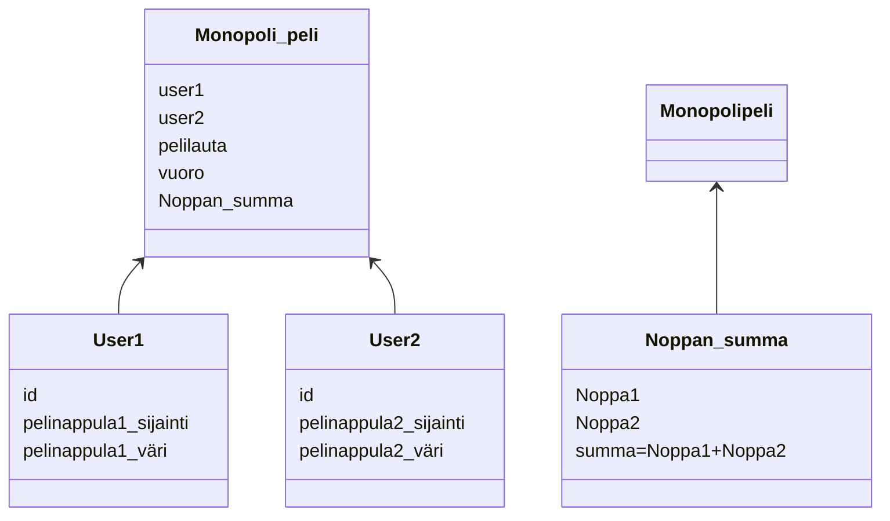

```mermaid
 classDiagram
      Monopoli_peli <-- User1
      Monopoli_peli <-- User2
      Monopolipeli  <-- Noppan_summa
      class Monopoli_peli{
          user1
          user2
          pelilauta
          vuoro
          Noppan_summa
      }
      class User1{
          id
          pelinappula1_sijainti
          pelinappula1_väri
	  
      }
      class User2{
          id
          pelinappula2_sijainti
          pelinappula2_väri
     }
      class Noppan_summa{
          Noppa1
          Noppa2
          summa=Noppa1+Noppa2       
      }

```
